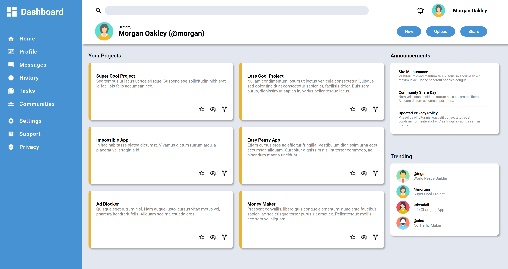

# Admin Dashboard

The project instructions encouraged using CSS Grid, but I went a bit further and built the entire layout with Grid. I intentionally used Grid even in areas where Flexbox might have been easier.

## 🖼️ Preview

[Netlify](https://egeto-admin-dashboard.netlify.app/)

This is a responsive admin dashboard project built as part of [The Odin Project](https://www.theodinproject.com/lessons/node-path-intermediate-html-and-css-admin-dashboard) curriculum.
